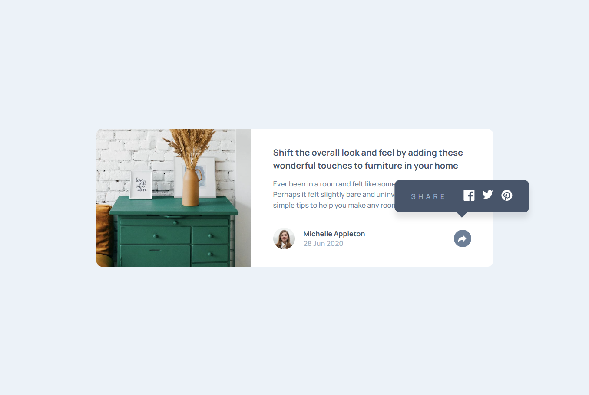

# Frontend Mentor - Article preview component solution

This is a solution to the [Article preview component challenge on Frontend Mentor](https://www.frontendmentor.io/challenges/article-preview-component-rdP673P6h). Frontend Mentor challenges help you improve your coding skills by building realistic projects.

## Table of contents

- [Overview](#overview)
  - [The challenge](#the-challenge)
  - [Screenshot](#screenshot)
  - [Links](#links)
- [My process](#my-process)
  - [Built with](#built-with)
  - [What I learned](#what-i-learned)
- [Author](#author)

## Overview

### The challenge

Users should be able to:

- View the optimal layout for the component depending on their device's screen size.
- See the social media share links when they click the share icon.
- Experience interactive states for the share button:
  - **Normal state**: Light grayish blue background with a grayish blue arrow.
  - **Active state**: Desaturated dark blue background with a white arrow.
- See a responsive tooltip:
  - **Mobile**: A full-width dark bar that replaces the author information.
  - **Desktop**: A floating bubble centered exactly above the share button.

### Screenshot



### Links

- Solution URL: (https://github.com/PatoCatejo/article-preview-component)
- Live Site URL: (https://patocatejo.github.io/article-preview-component/)

## My process

### Built with

- Semantic HTML5 markup
- CSS Custom properties (Variables)
- Flexbox
- Mobile-first workflow
- Vanilla JavaScript (DOM manipulation and class toggling)

### What I learned

The biggest challenge in this project was managing the positioning context for the share tooltip across different screen sizes.

I learned how to strategically switch the `position: relative` parent:

1. On **Mobile**, the tooltip is relative to the footer to ensure it covers the entire bottom area.
2. On **Desktop**, the tooltip is relative to the share button container to allow precise centering using the `transform` property.

Also, I practiced manipulating SVG colors dynamically through CSS:

```css
/* Changing the arrow color when the button is active */
.share-btn.active-btn svg path {
  fill: #ffffff;
}
```

## Author

- [Pato Catejo](https://github.com/PatoCatejo)
